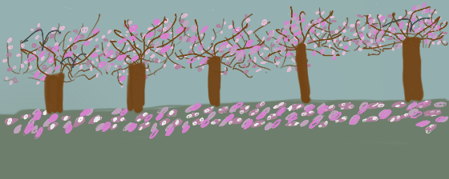

# KLA - 2D platformer

# Table of Contents
* [Inital Ideas](#inital-ideas)
* [Motivation](#motivation)
* [Development](#development)
* [Project Management](#project-management)
* [Game](#game)
* [Future Work](#future-work)

# Inital Ideas

Initially, we all had came together with different ideas between an interactive story similar to Minecraft, a puzzle game of looking at diffent places and a 2D platformer. After our initial meeting, we had decided we could incorporate the main components of all our ideas into a 2D platformer. 

# Motivation

Our goal is to create a 2D platformer where as a person progresses through a scene, they encounter and defeat enemies and a boss to progress through the levels. 

# Development

There were several different steps in planning that were taken to ensure that everyone was on the same page throughout the development process.

## Parts of Game Sketch

To gain a sense of the overall game, the storyline, scene and functionality were mapped relative to world, seed/hook, emotion, goal, suspense, obstacle, interaction/feedback, rules and levels.

There was also the presentation of the different ways the players functionality could be implemented.

## Updated Parts of Game

## Storyline 

The outline of the story centered in Japan with trying to defeat enemies that the individual encounters

Protagonist name: Mikhael
Masters' name: Darrius and Elena (Married Couple)

Getter: In a nation, reaped with chaos, despair and hopelessness, will your blade carve a new destiny, or fall victim to the threads of fate?

In a nation gripped by revolutionary fervor and untamed warfare, you are an indentured servant whose fate was nearly sealed on the bloodstained fields of your crumbling farm. From the farmlands that gave you life and hope now destroyed by the everlasting tides of war, ruining everything you once called home. Your only respite now is to move to the capitol, where all people live free from the tyranny of the leaders.

Hoping that one day you will find peace, freedom and revert back to the better life you once knew, you embark on the journey that will either empower or enfeeble you. Armed with your battered scythe - a symbol of both hope and freedom and the inevitable harvest of change, you represent your power amongst the encroaching forces of the Anti-Revolution army. As you fight these forces a mysterious power, unlike anything you have ever experienced controls your every movement. A balanced harmony, a swift strike, a sure end. The Flow State, a fleeting surge that lets you leap between enemies with surgical precision. Yet with every chain of perfectly timed strikes, the pressure mounts, the window to execute the next decisive blow narrows, echoing the tightening grip of a nation in upheaval.

As you traverse battle-scarred territories, your journey becomes an unforeseen catalyst. Every enemy vanquished, every move made in the heat of combat shifts the very heart of the government - an ever-moving capitol, which houses the revolutionary headquarters, serves to be slightly out of reach for the protagonist, dragging with them a sense of despair to not get this amnesty. With your ever-building courage, proceed with determination and fight to gain your right for freedom.

Encountering diverse footmen, powerful leaders, generals, lieutenants, and ultimate tyrants, you carve your destiny and shape a path for a future that would never have been thought to been accomplished by a servant such as yourself. In chaotic crucible of war, loyalty, and fate, your solitary battle becomes a test of precision, resolve, and the haunting realization that sometimes the greatest enemies lie within yourself. Rebel against the head, step into your Flow, and decide whether you will be the liberator that reclaims the nations soul, or the inadvertent harbinger of its downfall.

## 2D Platformer Inspiration

As a piece of inspiration, one of the levels from shovel night was analyzed.

## Updated Functionality

As the functionality is detailed and the storyline is going to be primarily communicated through semantics - the functionality was further revised and updated.

## Location 

With the inspiration of flowers, this led to the consideration of context to be in Japan as the cherry blossoms are beautiful. Therefore, as a person is traveling through the scene the goal was to see different places and therefore the Nakasendo road plays a role in creating storyline as a person travels.

## Level Design 

As the player progresses through the levels there are obstacles that are necessary to overcome. Below is Level 1 and 2 seperately

## Background Design 

There were several backgrounds created each made up of several layers. Additional layers to be layered on top was also created to create differences in the scences. In the images below contain some example of the scenes and the possibly scenes that could be created with the different layers.

The intial designs were done using Procreate 

  
  

## Character Design

The character was developed with the idea that the person was a traveler.

    

## Enemies Designs

## Draft 1 

The first draft of enemies were based on simple designs that are cammoflauged with the background.

The idea behind the enemies is that they are similar to a blob or a slimey thing that moves around in the scene. 

    

## Bosses Designs

### Draft 1

The design of these drafts were based on simple enemies.

The idea behind the boss designs is that they have multiple different colors to give an emotion that they are similar to a combination of all the enemies that they encountered

### Draft 2
These designs were inspired by Lieuteants. 

## Attack Options

There were several different designs that were considered for the enemies

The final attack that the group decided on was option 2 as shown below

  

## Flow State Attack

# Project Management

All communication was on discord and meetings were once a week to assign tasks. The [Trello Board](https://trello.com/b/PGbFmQW9/game-design-spring-2025) was used to keep a record of overall progress.

# Game
Note: GitHub Markdown does not support playing videos directly, so feel free to either click the thumb nail for the video or the link.

## Prototype of Game
[Link to Prototype](https://www.youtube.com/watch?v=d15Y0lfNLT4)

## Contributions
Everyone contributed when needed to help revise ideas but the leads for each portion are below:

### Kurt Kimura
- Character Design
- Player movement
- Flow state code
- Sprite for character
- Revision of Enenmies and Boss Designs and Sprite
- Sprites of character, enemies, and boss
- Final version of background
- Implement Sound

### Amanda Nitta
- Character Colors 
- Background Designs draft
- Flow State Launch backend code
- Update Website
- Enemies and Boss Designs
- Player character stats code
- Health recovery backend code
- Find Sound Effects

### Lloyd Sanderson
- Level Design
- Story creation
- Enemies movement code
- Flow state UI 
- Player Health UI
- Enemies Stat
- Enemies inspiration
- Find Sound Effects

# Future Work

## Team:
- [Kurt Kimura](https://kurtkimura02.github.io/)  (Senior ICS Student)
- [Amanda Nitta](https://www.linkedin.com/in/amandanitta/) (ICS Graduate Student) 
- [Lloyd Sanderson](https://lsanderson1.github.io/) (Senior ICS Student)